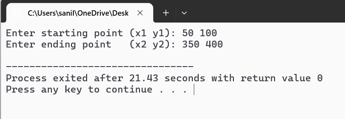
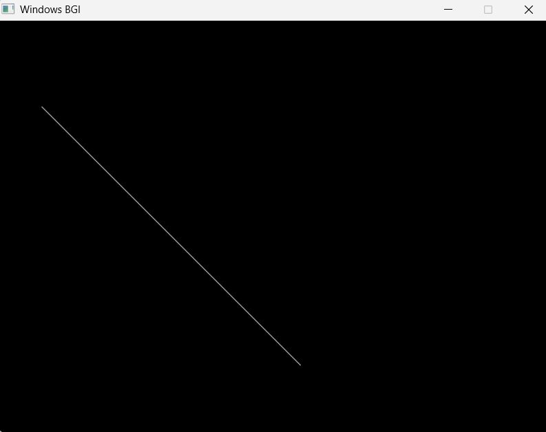

# Lab 02 — Line Drawing using Bresenham's Algorithm

**Course:** Computer Graphics (CSC209)  
**Semester:** III  
**Author:** Sanil Sthapit | [github.com/Sanil-Sth](https://github.com/Sanil-Sth)

---

## 📌 Title
2D Line Drawing using Bresenham's Line Drawing Algorithm

---

## 📖 Theory

In the previous lab, we used the **DDA Algorithm** to draw lines using floating point arithmetic. While simple, floating point operations are slow and can accumulate rounding errors over long lines.

**Bresenham's Line Drawing Algorithm** solves this problem. It is an **integer-only** algorithm — it uses only addition, subtraction, and bit shifting. This makes it significantly faster and more accurate than DDA.

The core idea is based on a **decision parameter** `p`:

> At each step, we decide whether the next pixel should be plotted directly to the right (East) or one step diagonally up/right (North-East), based on which one is geometrically closer to the true mathematical line.

For a line with slope `0 ≤ m ≤ 1` (the base case):

- Calculate `dx = x2 - x1` and `dy = y2 - y1`
- Initial decision parameter: `p = 2*dy - dx`
- If `p < 0`: plot the East pixel → `p = p + 2*dy`
- If `p ≥ 0`: plot the North-East pixel → `p = p + 2*dy - 2*dx`

This logic is generalized for all slopes and directions by swapping roles of x and y and adjusting increment signs.

### Advantages
- Uses only integer arithmetic — fast and efficient
- No rounding errors — more accurate than DDA
- Widely used in hardware implementations (GPU rasterizers)

### Disadvantages
- Slightly more complex to understand and implement than DDA
- Requires handling multiple cases for different slopes

---

## ❓ Question

Write a program to draw a 2D line using Bresenham's Line Drawing Algorithm.

---

## 🔢 Algorithm
```
Step 1:  Start
Step 2:  Input the two endpoints: (x1, y1) and (x2, y2)
Step 3:  Calculate:
             dx = |x2 - x1|
             dy = |y2 - y1|
Step 4:  Determine step directions:
             sx = 1 if x1 < x2, else -1
             sy = 1 if y1 < y2, else -1
Step 5:  Initialize decision parameter:
             if dx >= dy:  p = 2*dy - dx
             if dy > dx:   p = 2*dx - dy
Step 6:  Plot pixel at (x1, y1)
Step 7:  Repeat until (x1, y1) reaches (x2, y2):
             If shallow slope (dx >= dy):
                 If p < 0:  x1 += sx,  p += 2*dy
                 Else:      x1 += sx,  y1 += sy,  p += 2*dy - 2*dx
             If steep slope (dy > dx):
                 If p < 0:  y1 += sy,  p += 2*dx
                 Else:      x1 += sx,  y1 += sy,  p += 2*dx - 2*dy
             Plot pixel at (x1, y1)
Step 8:  Stop
```

---

## 💻 Source Code
```cpp
#include <stdio.h>
#include <conio.h>
#include <graphics.h>
#include <math.h>

void drawBresenham(int x1, int y1, int x2, int y2, int color) {
    int dx = abs(x2 - x1);
    int dy = abs(y2 - y1);

    int sx = (x1 < x2) ? 1 : -1;
    int sy = (y1 < y2) ? 1 : -1;

    int p;

    putpixel(x1, y1, color);

    if (dx >= dy) {
        p = 2 * dy - dx;
        while (x1 != x2) {
            x1 += sx;
            if (p < 0) {
                p += 2 * dy;
            } else {
                y1 += sy;
                p += 2 * dy - 2 * dx;
            }
            putpixel(x1, y1, color);
        }
    } else {
        p = 2 * dx - dy;
        while (y1 != y2) {
            y1 += sy;
            if (p < 0) {
                p += 2 * dx;
            } else {
                x1 += sx;
                p += 2 * dx - 2 * dy;
            }
            putpixel(x1, y1, color);
        }
    }
}

int main() {
    int gd = DETECT, gm;
    initgraph(&gd, &gm, (char*)"");

    int x1, y1, x2, y2;

    printf("Enter starting point (x1 y1): ");
    scanf("%d %d", &x1, &y1);
    printf("Enter ending point   (x2 y2): ");
    scanf("%d %d", &x2, &y2);

    drawBresenham(x1, y1, x2, y2, WHITE);

    getch();
    closegraph();
    return 0;
}
```

---

## 🖼️ Output

### 1. Console Output
*Shows the user input for the line coordinates*



---

### 2. GUI Output
*The BGI graphics window showing the line drawn by Bresenham's algorithm*



---

### 3. Zoomed Output
*Zoomed in view clearly showing individual pixels plotted by the algorithm*


> 💡 The zoomed view highlights how Bresenham's algorithm selects the closest integer pixel at each step — using only integer comparisons, no floating point.

---

## ✅ Conclusion

In this lab, we successfully implemented **Bresenham's Line Drawing Algorithm** in C using `graphics.h`. Unlike the DDA algorithm from Lab 01, Bresenham's method uses only integer arithmetic — making it faster and free from floating point rounding errors.

The algorithm correctly handles all line slopes and directions by using a decision parameter `p` that determines, at each step, which of the two candidate pixels lies closer to the true mathematical line.

While slightly more complex to implement than DDA, Bresenham's algorithm is the preferred choice in practice and is widely used in graphics hardware for exactly these reasons.

---

*Previous: [Lab 01 — DDA Line Drawing Algorithm](../Lab-01-DDA-Line/)*  
*Next: [Lab 03 — Circle Drawing (Raster Graphics)](../Lab-03-Circle-Raster/)*
