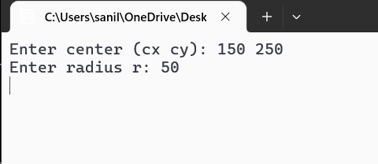
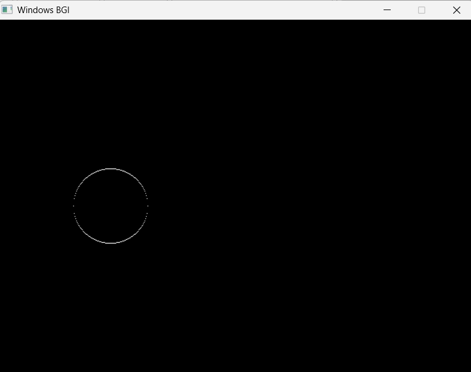
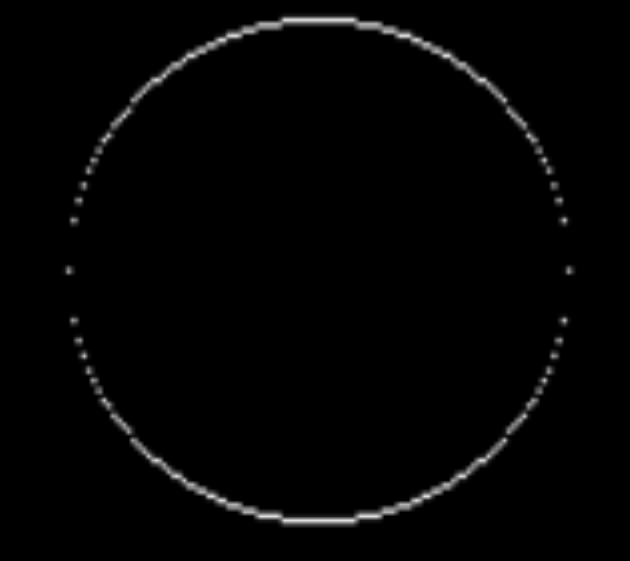

# Lab 03 — Circle Drawing using Raster Graphics

**Course:** Computer Graphics (CSC209)  
**Semester:** III  
**Author:** Sanil Sthapit | [github.com/Sanil-Sth](https://github.com/Sanil-Sth)

---

## 📌 Title
Circle Drawing using Raster Graphics (Trigonometric / Polynomial Method)

---

## 📖 Theory

A circle is defined as the set of all points at a fixed distance (radius `r`) from a center point `(cx, cy)`. Mathematically:

> **(x - cx)² + (y - cy)² = r²**

However, a computer screen is made of discrete pixels — so we cannot plot a continuous circle. We need an algorithm to decide which pixels to turn on so that they appear as a circle.

The **Raster Graphics (Polynomial) Method** is the most straightforward approach. It uses the equation of a circle directly:

- Step along the X axis from `cx - r` to `cx + r`
- At each X, calculate the corresponding Y using: `y = sqrt(r² - (x - cx)²)`
- Plot both `(x, cy + y)` and `(x, cy - y)` to draw both the upper and lower halves

### Why plot both halves?
Because the square root always returns a positive value, only the upper half is computed. Negating it gives the lower half. Together they form a complete circle.

### Advantages
- Simple and easy to understand
- Directly based on the mathematical definition of a circle

### Disadvantages
- Uses floating point `sqrt()` — slow and computationally expensive
- Uneven pixel spacing — gaps appear on steep parts of the circle
- Not suitable for real-time or hardware rendering

---

## ❓ Question

Write a program to draw a circle using the Raster Graphics (Polynomial) method.

---

## 🔢 Algorithm

```
Step 1: Start
Step 2: Input center (cx, cy) and radius r
Step 3: Set x = cx - r
Step 4: Repeat while x <= cx + r:
            Calculate: y = sqrt(r*r - (x-cx)*(x-cx))
            Plot pixel at (x, cy + round(y))   ← upper half
            Plot pixel at (x, cy - round(y))   ← lower half
            x = x + 1
Step 5: Stop
```

---

## 💻 Source Code

```cpp
#include <stdio.h>
#include <conio.h>
#include <graphics.h>
#include <math.h>

void drawCircleRaster(int cx, int cy, int r, int color) {
    int x = cx - r;

    while (x <= cx + r) {
        // Calculate y using circle equation: x² + y² = r²
        double y = sqrt((double)(r * r) - (double)((x - cx) * (x - cx)));

        // Plot upper and lower halves
        putpixel(x, cy + (int)round(y), color);
        putpixel(x, cy - (int)round(y), color);

        x++;
    }
}

int main() {
    int gd = DETECT, gm;
    initgraph(&gd, &gm, (char*)"");

    int cx, cy, r;

    printf("Enter center (cx cy): ");
    scanf("%d %d", &cx, &cy);
    printf("Enter radius r: ");
    scanf("%d", &r);

    drawCircleRaster(cx, cy, r, WHITE);

    getch();
    closegraph();
    return 0;
}
```

---

## 🖼️ Output

### 1. Console Output
*Shows the user input for center and radius*



---

### 2. GUI Output
*The BGI graphics window showing the circle drawn by the Raster method*



---

### 3. Zoomed Output
*Zoomed in view showing individual pixels and gaps caused by the polynomial method*



> 💡 The zoomed view clearly shows the limitation of the Raster method — uneven pixel gaps appear on steep sections of the circle because we only step along X, not along the curve itself.

---

## ✅ Conclusion

In this lab, we successfully implemented the **Raster Graphics (Polynomial) Circle Drawing Method** in C using `graphics.h`. The program accepts a center and radius from the user and draws a circle by computing Y values directly from the circle equation.

While simple to understand, this method has clear limitations — it relies on floating point `sqrt()` at every step, making it slow, and it produces uneven pixel spacing leading to visible gaps. These limitations motivate the need for better algorithms like the **Midpoint Circle Algorithm**, which we will implement in Lab 04.

---

*Previous: [Lab 02 — Bresenham's Line Drawing Algorithm](../Lab-02-Bresenham-Line/)*  
*Next: [Lab 04 — Midpoint Circle + Arc & Sector](../Lab-04-Midpoint-Circle/)*
